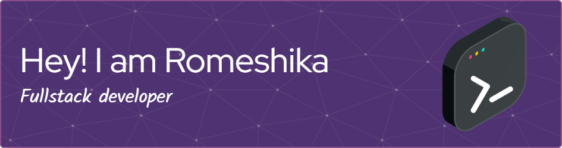

  

  

### 👨‍💻 About Me
- 🔭 **Currently working on**: **Test**
- 🌱 **Learning**: **Next.js**
- 💬 **Ask me about**: **Web development | OOC | MERN stack**

---

### 📚 Connect with Me:

  
  

---

<h3 align="left">Languages and Tools:</h3>

        

# 💻 Tech Stack:
     
# 📊 GitHub Stats:

  
  
  

  

---

  Proudly created with ❤️ by [Romeshika Dewmini](https://github.com/RomeshikaDewmini)

<!-- Proudly created with GPRM ( https://gprm.itsvg.in ) -->
