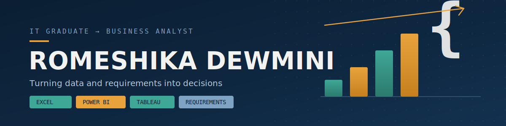

  

  

### 👨‍💻 About Me

- 🎓 **IT Undergraduate** passionate about **Business Analysis** and **Web Development**
- 🌱 **Currently Learning**: Business Analysis, Agile & Scrum, Next.js, and Requirement Engineering
- 📖 **Exploring**: UML, Business Process Modeling, and System Analysis
- 💬 **Ask me about**: Web Development | MERN Stack | Business Analysis Basics
- 🎯 **Currently Seeking**: Business Analyst / Software Engineering Internship

---

<h3 align="center">🤝 Let's Connect</h3>

  I'm always interested in connecting with professionals, collaborating on projects,
  and exploring internship opportunities in <b>Business Analysis</b> and
  <b>Software Engineering</b>.

  
  
  

---
## 🛠️ Skills & Tools

<!-- Programming Languages -->

<!-- BA Tools -->

💼 <b>Business Analysis:</b> Requirement Gathering • Requirement Analysis • UML • Use Case Diagrams • Activity Diagrams • User Stories • Agile • Scrum • Documentation

# 💻 Tech Stack & Skills:

### 👨‍💻 Development

### 🗄️ Database

### 📊 Business Analysis

### 🛠️ Tools

---
# 📈 GitHub Activity

  

---
# 📊 GitHub Stats:

  

  

  

  

---

  Proudly created with ❤️ by [Romeshika Dewmini](https://github.com/RomeshikaDewmini)

<!-- Proudly created with GPRM ( https://gprm.itsvg.in ) -->
